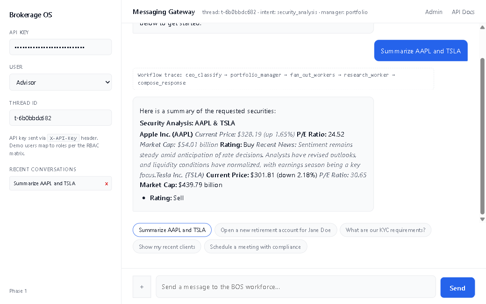
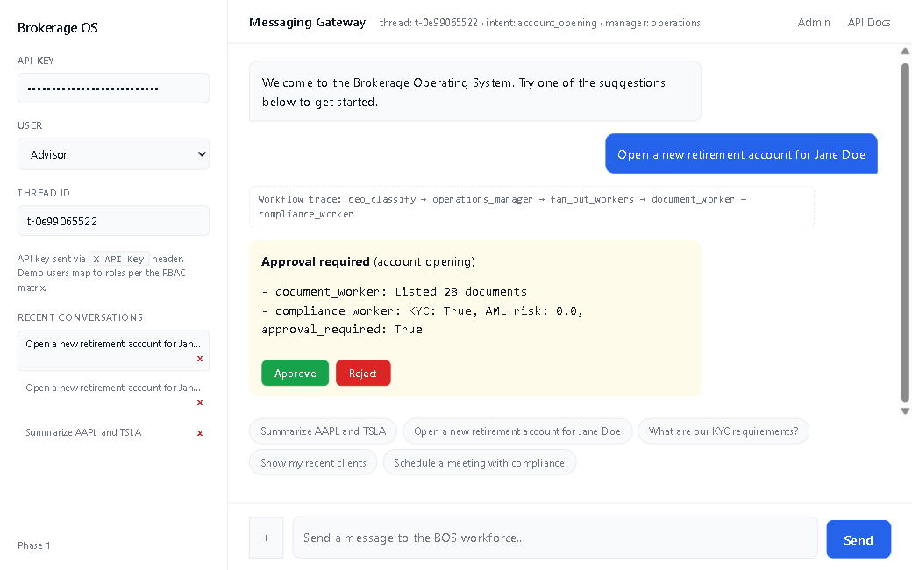
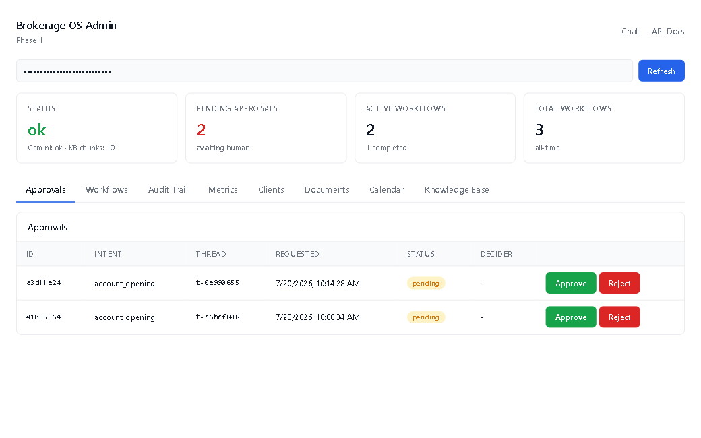
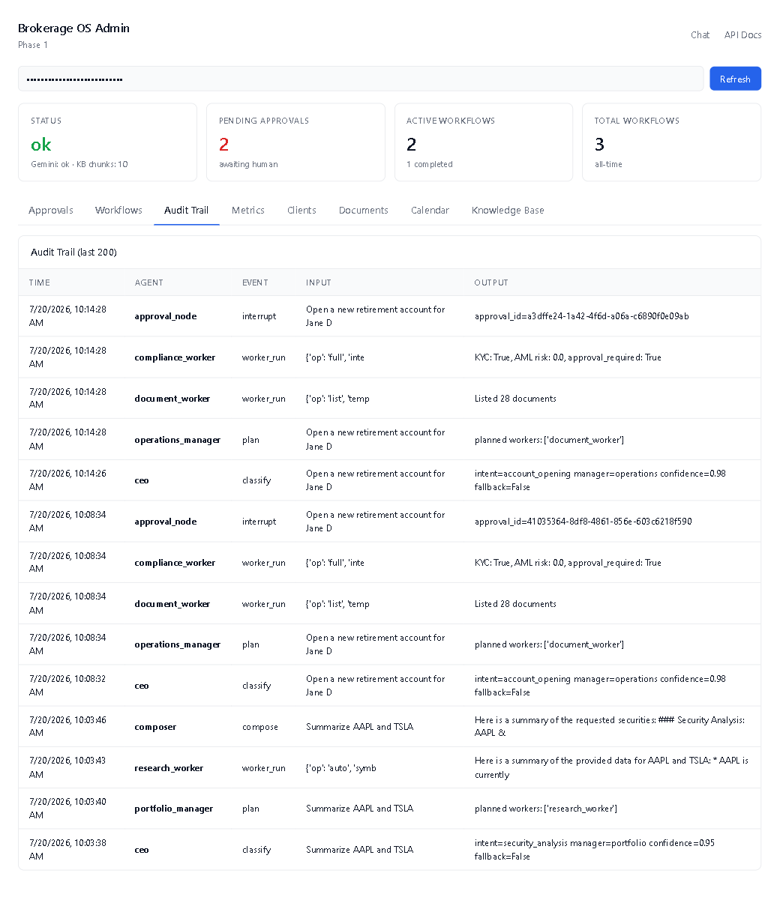
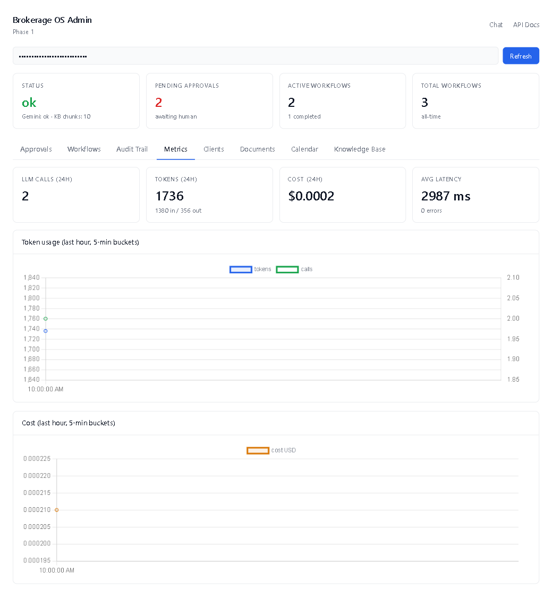
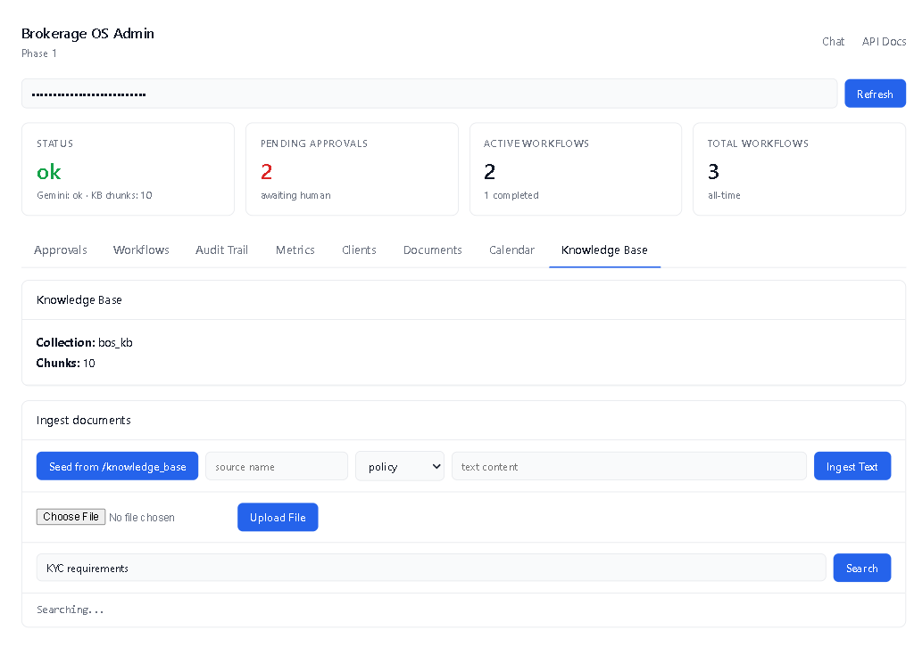

# Brokerage Operating System (BOS)

An AI-native, multi-agent operating system for brokerage firms. BOS coordinates
specialized AI agents (CEO, Operations, Compliance, Portfolio managers +
6 workers) to automate 80% of brokerage operational work while keeping humans
in charge of approvals.

Built on **LangGraph** hierarchical orchestration, **Google Vertex AI** (Gemini)
for LLM + embeddings, and a fully **local-first** storage stack (SQLite +
ChromaDB). No external services required beyond your Google Cloud account.

> Implements the Phase 1 PRD in `prd.md`. See `GAP_ANALYSIS.md` for a precise
> requirement-by-requirement status table.

---

## Screenshots

### Chat UI — research workflow with Vertex AI live response


### HITL approval card — interrupt before risky action


### Admin dashboard — approval queue


### Admin dashboard — audit trail (every agent event)


### Admin dashboard — token / cost / latency metrics


### Admin dashboard — KB semantic search


---

## What's inside

| Area | Implementation |
|------|----------------|
| **Orchestration** | LangGraph `StateGraph` — CEO → Manager → Worker, conditional routing, retries (max 2 per worker), confidence-threshold clarification |
| **Agents** | 1 CEO + 3 Managers (Operations / Compliance / Portfolio) + 6 Workers (CRM, Document, Compliance, Research, Calendar, Retrieval) |
| **LLM** | Google Vertex AI `gemini-2.5-flash` (auth via ADC, no API key) |
| **Embeddings** | Vertex AI `text-embedding-004` (768-dim) |
| **Short-term memory** | LangGraph `SqliteSaver` checkpointer (per-`thread_id`) |
| **Long-term memory** | SQLite-backed `user_profiles` + `user_facts` |
| **Organizational memory** | ChromaDB (file-based) — RAG with citation support |
| **HITL approvals** | LangGraph `interrupt()` + audit-persisted records + resume via API/UI + 30-min timeout scheduler |
| **Messaging gateway** | Web chat (SSE + WebSocket), Slack adapter (events + slash command), file attachments |
| **Audit trail** | Every node event persisted with timestamp, agent, reasoning, tools, documents, approval |
| **Security** | API-key auth (timing-safe), RBAC (5 roles), PII masking, tool permission matrix, CORS lockdown, rate limiting, masked error responses |
| **Observability** | structlog JSON, per-call token/cost/latency metrics, Chart.js dashboard, LangSmith opt-in |
| **Admin dashboard** | KPIs, approvals, workflows, audit trail, metrics charts, clients, documents, calendar, KB ingest + search |
| **Resilience** | Rule-based fallback classifier + planner + composer when LLM unavailable; worker retry with backoff; approval expiry scheduler |
| **Testing** | 63 automated tests (unit + integration + regression), all passing offline |
| **Deployment** | Dockerfile + docker-compose + GitHub Actions CI + Kubernetes manifests + HPA |

---

## Architecture

```
                   User (web chat / REST / WebSocket / Slack)
                              │
                              ▼
                    Messaging Gateway (FastAPI)
                              │
                              ▼
                       ┌─────────────┐
                       │  CEO Agent  │  (intent classification + routing)
                       └─────────────┘
                              │
              ┌───────────────┼───────────────┐
              ▼               ▼               ▼
        Operations        Compliance       Portfolio
         Manager           Manager          Manager
              │               │               │
              └───────────────┴───────────────┘
                              │
                              ▼
                  ┌───────────────────────┐
                  │  fan_out_workers      │  ← guardrail: force compliance_worker
                  │  (with retry + policy │    for approval-gated intents
                  │  enforcement)         │
                  └───────────────────────┘
                              │
                              ▼
                  ┌───────────────────────┐
                  │  approval_router      │  → request_approval [INTERRUPT]
                  │                       │  → resume on human decision
                  └───────────────────────┘
                              │
                              ▼
                  ┌───────────────────────┐
                  │  compose_response     │  (Gemini final answer)
                  └───────────────────────┘
                              │
                              ▼
                          END / user
```

### Worker registry

| Manager     | Workers                                              |
| ----------- | ---------------------------------------------------- |
| Operations  | `crm_worker`, `document_worker`, `calendar_worker`   |
| Compliance  | `compliance_worker`, `retrieval_worker`              |
| Portfolio   | `research_worker`, `retrieval_worker`                |

---

## Quick start

### Prerequisites
- Python **3.10+**
- A Google Cloud project with **Vertex AI API** enabled
- `gcloud` CLI installed

### 1. Clone & install
```bash
git clone https://github.com/MazkaB/brokerage-os.git
cd brokerage-os/bos
pip install -r requirements.txt
```

### 2. Authenticate with Google Cloud (ADC)
```bash
gcloud auth login
gcloud auth application-default login
gcloud config set project YOUR_GCP_PROJECT_ID
gcloud services enable aiplatform.googleapis.com
```

### 3. Configure environment
```bash
cp .env.example .env
# Edit .env: set GCP_PROJECT_ID to your project
```

### 4. Initialize database + ingest sample knowledge base
```bash
python scripts/init_db.py
python scripts/ingest_docs.py
```

### 5. Run the server
```bash
python -m uvicorn app.main:app --host 0.0.0.0 --port 8000
```

Open in your browser:
- **Chat UI:** http://localhost:8000
- **Admin dashboard:** http://localhost:8000/admin
- **API docs:** http://localhost:8000/docs

The API key used by the UI is pre-filled (`bos-local-dev-key-CHANGE-ME`).
Change `BOS_API_KEY` in `.env` for any non-local usage.

---

## API reference (highlights)

| Method | Path                              | Description                          |
| ------ | --------------------------------- | ------------------------------------ |
| POST   | `/api/chat`                       | Run one BOS turn (JSON)              |
| POST   | `/api/chat/stream`                | Run one BOS turn (SSE)               |
| WS     | `/api/chat/ws`                    | WebSocket transport                  |
| POST   | `/api/chat/upload`                | Upload attachment (auto-ingests to KB) |
| POST   | `/api/chat/resume`                | Resume an interrupted workflow       |
| GET    | `/api/approvals`                  | List approval requests               |
| POST   | `/api/approvals/{id}/decision`    | Approve / reject (RBAC enforced)     |
| GET    | `/api/admin/health`               | Liveness + Vertex AI + KB stats      |
| GET    | `/api/admin/metrics`              | Token / cost / latency aggregates    |
| GET    | `/api/admin/workflows`            | Workflow history                     |
| GET    | `/api/admin/audit`                | Audit trail (last N events)          |
| POST   | `/api/ingest/text`                | Ingest raw text                      |
| POST   | `/api/ingest/file`                | Ingest .txt/.md/.pdf                 |
| POST   | `/api/ingest/seed`                | Re-ingest /knowledge_base folder     |
| GET    | `/api/ingest/search?q=...`        | Semantic search                      |
| POST   | `/api/slack/event`                | Slack Events API callback            |
| POST   | `/api/slack/command`              | Slack slash command                  |

Full OpenAPI schema at `/docs` when the server is running.

---

## Tests

```bash
cd bos
pytest tests/ -v
```

63 tests across:
- `tests/test_tools.py` — CRM, documents, calendar, compliance, research
- `tests/test_security.py` — auth, RBAC, PII masking, tool policy, output validation
- `tests/test_graph.py` — graph topology, routing, fallback, HITL interrupt
- `tests/test_api.py` — FastAPI endpoints (TestClient)
- `tests/test_security_fixes.py` — regression tests for security audit fixes

All tests run **fully offline** (LLM calls mocked).

---

## Docker

```bash
export GCP_PROJECT_ID=your-project
export BOS_API_KEY=$(openssl rand -hex 24)
docker compose up --build
```

Persistent data lives in the `bos-data` named volume (SQLite + Chroma).

---

## Kubernetes

```bash
kubectl create secret generic bos-secrets \
  --from-literal=gcp-project-id=YOUR_PROJECT \
  --from-literal=bos-api-key=$(openssl rand -hex 24) \
  --from-literal=bos-jwt-secret=$(openssl rand -hex 24)

kubectl apply -f bos/deploy/k8s/
```

Includes `Deployment`, `Service`, `PVC`, `Ingress` (TLS-ready), and `HPA`.

---

## Documents in this repo

| File | Purpose |
|------|---------|
| `prd.md` | Original Product Requirements Document (Phase 1) |
| `README.md` | This file |
| `GAP_ANALYSIS.md` | Requirement-by-requirement status table |
| `SETUP_NOTES.md` | Manual setup steps + troubleshooting |
| `TEST_REPORT.md` | E2E + integration test report (Playwright + curl) |
| `SECURITY_AUDIT.md` | 22 security findings, severity-ranked, with remediation |
| `IMPROVEMENT_ANALYSIS.md` | Code quality + missing features analysis |
| `LICENSE` | MIT |
| `bos/` | Application source code |
| `bos/docs/screenshots/` | Live screenshots (referenced above) |
| `bos/deploy/k8s/` | Kubernetes manifests |

---

## Phase 2 roadmap

The following are explicitly deferred per PRD §5 and `GAP_ANALYSIS.md`:

- AES-256 at rest with KMS-managed keys
- PostgreSQL migration (from SQLite)
- Real tool integrations (Salesforce, DocuSign, Bloomberg, live broker APIs)
- True parallel workers via LangGraph `Send` API
- OpenTelemetry + Grafana dashboards
- Prompt-injection detection
- Memory TTL / pruning / summarization pipeline
- Real Slack/Teams OAuth flow (currently webhook adapter)
- Eval harness for KPIs (intent accuracy, hallucination rate)
- Compliance certifications (SOC2 / FINRA / SEC)
- Voice channel

---

## License

MIT — see [LICENSE](./LICENSE).
